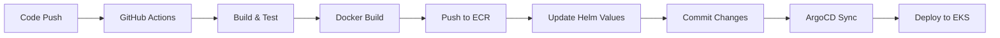

# Job Portal Management System - GitOps 
Deployment Guide


<div align="center">

[](Stars)


<strong>
<h2>Cloud-Native 3-Tier Spring Boot Application</h2>
</strong>

**Production-ready Job Portal deployed on AWS EKS using GitOps principles with automated CI/CD pipeline**

</div>

---

## Table of Contents

- [Quick Start](#-quick-start)
- [Architecture](#️-architecture)
- [Prerequisites](#-prerequisites)
- [Installation](#-installation)
- [Deployment](#-deployment)
- [GitOps Workflow](#-gitops-workflow)
- [Monitoring](#-monitoring)
- [Troubleshooting](#-troubleshooting)
- [Cleanup](#-cleanup)
- [Advanced Topics](#-advanced-topics)

---

## 🚀 Quick Start

**Deploy the complete Job Portal application!**

- **Controller Layer**: REST API endpoints for jobs, applications, users
- **Service Layer**: Business logic with JWT authentication
- **Repository Layer**: JPA/Hibernate with MySQL database
- **Security**: Spring Security with Role-Based Access Control

---

## 🏗️ Architecture

### **Application Architecture (3-Tier)**

The Job Portal follows a clean 3-tier architecture:

```
┌─────────────────────────────────────────────────────────────┐
│                    PRESENTATION LAYER                        │
│  ┌─────────────┐ ┌─────────────┐ ┌─────────────────────────┐│
│  │JobController│ │UserController│ │ApplicationController   ││
│  └─────────────┘ └─────────────┘ └─────────────────────────┘│
├─────────────────────────────────────────────────────────────┤
│                     SERVICE LAYER                            │
│  ┌───────────┐ ┌────────────┐ ┌──────────────────────────┐  │
│  │JobService │ │UserService │ │ApplicationService        │  │
│  │           │ │+ AuthService│ │                          │  │
│  └───────────┘ └────────────┘ └──────────────────────────┘  │
├─────────────────────────────────────────────────────────────┤
│                    REPOSITORY LAYER                          │
│  ┌─────────────┐ ┌──────────────┐ ┌───────────────────────┐ │
│  │JobRepository│ │UserRepository│ │ApplicationRepository  │ │
│  └─────────────┘ └──────────────┘ └───────────────────────┘ │
├─────────────────────────────────────────────────────────────┤
│                      DATABASE                                │
│                   ┌───────────┐                              │
│                   │  MySQL 8  │                              │
│                   └───────────┘                              │
└─────────────────────────────────────────────────────────────┘
```

| Layer          | Technology          | Purpose                          |
| -------------- | ------------------- | -------------------------------- |
| **Controller** | Spring MVC          | REST API endpoints               |
| **Service**    | Spring + JWT        | Business logic & authentication  |
| **Repository** | Spring Data JPA     | Database operations              |
| **Database**   | MySQL 8.0 / H2      | Data persistence                 |
| **Security**   | Spring Security     | JWT + RBAC                       |

### **Cloud Deployment Architecture**

```
┌──────────────────────────────────────────────────────────────────┐
│                         AWS CLOUD                                 │
│  ┌────────────────────────────────────────────────────────────┐  │
│  │                    Amazon EKS Cluster                       │  │
│  │  ┌─────────────┐  ┌─────────────┐  ┌─────────────────────┐ │  │
│  │  │   Ingress   │  │   ArgoCD    │  │    Prometheus       │ │  │
│  │  │  Controller │  │   (GitOps)  │  │    + Grafana        │ │  │
│  │  └─────────────┘  └─────────────┘  └─────────────────────┘ │  │
│  │  ┌─────────────────────────────────────────────────────┐   │  │
│  │  │              Job Portal Application                  │   │  │
│  │  │  ┌─────────┐  ┌─────────┐  ┌─────────┐              │   │  │
│  │  │  │ Pod 1   │  │ Pod 2   │  │ Pod 3   │  (HPA)       │   │  │
│  │  │  └─────────┘  └─────────┘  └─────────┘              │   │  │
│  │  └─────────────────────────────────────────────────────┘   │  │
│  └────────────────────────────────────────────────────────────┘  │
│  ┌──────────────┐  ┌──────────────┐  ┌──────────────────────┐    │
│  │  Amazon ECR  │  │  Amazon RDS  │  │  AWS Secrets Manager │    │
│  │  (Images)    │  │  (MySQL)     │  │  (Credentials)       │    │
│  └──────────────┘  └──────────────┘  └──────────────────────┘    │
└──────────────────────────────────────────────────────────────────┘
```

### **GitOps Workflow**



**🎯 What you get:**

- **Purpose**: Full production workflow with CI/CD pipeline
- **Images**: Private ECR (auto-updated with commit hashes)
- **Deployment**: Automated via GitHub Actions + ArgoCD
- **Updates**: Automatic on code changes
- **Best for**: Production environments, enterprise deployments

---

## 📋 Prerequisites

### **Required Tools**

| Tool          | Version | Installation                                                                         |
| ------------- | ------- | ------------------------------------------------------------------------------------ |
| **Java**      | 17+     | [Install Guide](https://adoptium.net/installation/)                                  |
| **Maven**     | 3.8+    | [Install Guide](https://maven.apache.org/install.html)                               |
| **AWS CLI**   | v2+     | [Install Guide](https://docs.aws.amazon.com/cli/latest/userguide/install-cliv2.html) |
| **Terraform** | 1.0+    | [Install Guide](https://developer.hashicorp.com/terraform/install)                   |
| **kubectl**   | 1.28+   | [Install Guide](https://kubernetes.io/docs/tasks/tools/)                             |
| **Docker**    | 20.0+   | [Install Guide](https://docs.docker.com/get-docker/)                                 |
| **Helm**      | 3.0+    | [Install Guide](https://helm.sh/docs/intro/install/)                                 |
| **Git**       | 2.0+    | [Install Guide](https://git-scm.com/downloads)                                       |

### **Quick Installation Scripts**

<details>
<summary><strong>🔧 One-Click Installation (Amazon Linux EC2)</strong></summary>

```bash
#!/bin/bash
# Install all prerequisites on Amazon Linux 2023 / Amazon Linux 2

# Update system packages
sudo yum update -y

# Install required utilities
sudo yum install -y wget unzip git tar gzip

# Java 17 (Amazon Corretto - AWS's distribution of OpenJDK)
sudo yum install -y java-17-amazon-corretto-devel

# Set JAVA_HOME
echo 'export JAVA_HOME=/usr/lib/jvm/java-17-amazon-corretto' | sudo tee -a /etc/profile.d/java.sh
echo 'export PATH=$PATH:$JAVA_HOME/bin' | sudo tee -a /etc/profile.d/java.sh
source /etc/profile.d/java.sh

# Maven
sudo yum install -y maven
# Or install latest version manually:
# wget https://dlcdn.apache.org/maven/maven-3/3.9.6/binaries/apache-maven-3.9.6-bin.tar.gz
# sudo tar -xzf apache-maven-3.9.6-bin.tar.gz -C /opt
# sudo ln -s /opt/apache-maven-3.9.6/bin/mvn /usr/local/bin/mvn

# AWS CLI (pre-installed on Amazon Linux, but update to latest)
sudo yum remove -y awscli  # Remove v1 if present
curl "https://awscli.amazonaws.com/awscli-exe-linux-x86_64.zip" -o "awscliv2.zip"
unzip awscliv2.zip
sudo ./aws/install --update
rm -rf aws awscliv2.zip

# Terraform
sudo yum install -y yum-utils
sudo yum-config-manager --add-repo https://rpm.releases.hashicorp.com/AmazonLinux/hashicorp.repo
sudo yum install -y terraform

# kubectl
curl -LO "https://dl.k8s.io/release/v1.28.0/bin/linux/amd64/kubectl"
chmod +x kubectl
sudo mv kubectl /usr/local/bin/

# Docker
sudo yum install -y docker
sudo systemctl start docker
sudo systemctl enable docker
sudo usermod -aG docker $USER

# Helm
curl https://raw.githubusercontent.com/helm/helm/main/scripts/get-helm-3 | bash

# Apply group changes (logout/login required, or use newgrp)
newgrp docker

# Verify installations
echo "=== Verifying Installations ==="
java --version
mvn --version
aws --version
terraform --version
kubectl version --client
docker --version
helm version
echo "=== All tools installed successfully! ==="
```

**Note:** After running the script, log out and log back in for Docker group permissions to take effect, or run `newgrp docker`.

</details>

<details>
<summary><strong>🔧 Amazon Linux 2 Specific Installation</strong></summary>

```bash
#!/bin/bash
# Install all prerequisites on Amazon Linux 2

# Update system
sudo yum update -y

# Install amazon-linux-extras for additional packages
sudo amazon-linux-extras install -y java-openjdk17
sudo amazon-linux-extras install -y docker

# Enable and start Docker
sudo systemctl start docker
sudo systemctl enable docker
sudo usermod -aG docker $USER

# Install Git
sudo yum install -y git

# Maven (install manually as not available in amazon-linux-extras)
wget https://dlcdn.apache.org/maven/maven-3/3.9.6/binaries/apache-maven-3.9.6-bin.tar.gz
sudo tar -xzf apache-maven-3.9.6-bin.tar.gz -C /opt
sudo ln -s /opt/apache-maven-3.9.6/bin/mvn /usr/local/bin/mvn
rm apache-maven-3.9.6-bin.tar.gz

# AWS CLI v2
curl "https://awscli.amazonaws.com/awscli-exe-linux-x86_64.zip" -o "awscliv2.zip"
unzip awscliv2.zip
sudo ./aws/install
rm -rf aws awscliv2.zip

# Terraform
sudo yum install -y yum-utils
sudo yum-config-manager --add-repo https://rpm.releases.hashicorp.com/AmazonLinux/hashicorp.repo
sudo yum install -y terraform

# kubectl
curl -LO "https://dl.k8s.io/release/v1.28.0/bin/linux/amd64/kubectl"
chmod +x kubectl
sudo mv kubectl /usr/local/bin/

# Helm
curl https://raw.githubusercontent.com/helm/helm/main/scripts/get-helm-3 | bash

# Verify installations
java --version
mvn --version
aws --version
terraform --version
kubectl version --client
docker --version
helm version
```

</details>

<details>
<summary><strong>🔧 Windows Installation (PowerShell)</strong></summary>

```powershell
# Install Chocolatey first (if not installed)
Set-ExecutionPolicy Bypass -Scope Process -Force
[System.Net.ServicePointManager]::SecurityProtocol = [System.Net.ServicePointManager]::SecurityProtocol -bor 3072
iex ((New-Object System.Net.WebClient).DownloadString('https://community.chocolatey.org/install.ps1'))

# Install all tools
choco install openjdk17 maven awscli terraform kubernetes-cli docker-desktop kubernetes-helm git -y

# Verify installations
java --version
mvn --version
aws --version
terraform --version
kubectl version --client
docker --version
helm version
```

</details>

### **AWS Account Requirements**

- **AWS Account** with appropriate permissions
- **IAM User/Role** with EKS, ECR, RDS, VPC permissions

### **EC2 Instance Requirements (Recommended)**

| Resource         | Minimum     | Recommended  |
| ---------------- | ----------- | ------------ |
| **Instance Type**| t3.medium   | t3.large     |
| **Storage**      | 30 GB EBS   | 50 GB EBS    |
| **AMI**          | Amazon Linux 2023 or Amazon Linux 2 |
| **Security Group**| SSH (22), HTTP (80), HTTPS (443) |

**EC2 IAM Role Permissions (attach to EC2 instance):**
```json
{
    "Version": "2012-10-17",
    "Statement": [
        {
            "Effect": "Allow",
            "Action": [
                "eks:*",
                "ecr:*",
                "rds:*",
                "ec2:*",
                "elasticloadbalancing:*",
                "iam:PassRole",
                "iam:CreateServiceLinkedRole",
                "secretsmanager:*",
                "s3:*",
                "dynamodb:*"
            ],
            "Resource": "*"
        }
    ]
}
```

> **💡 Tip:** Using an IAM Role attached to EC2 is more secure than storing AWS credentials on the instance.

---

## 🔧 Installation

### **Step 1: Clone Repository**

```bash
git clone https://github.com/yourusername/job-portal-management-system.git
cd job-portal-management-system
```

### **Step 2: Build Application Locally**

```bash
# Build the application
mvn clean package -DskipTests

# Run locally with H2 database
mvn spring-boot:run -Dspring-boot.run.profiles=dev

# Access: http://localhost:8080
```

### **Step 3: Configure AWS**

**Option A: Using EC2 Instance Role (Recommended)**

If your EC2 instance has an IAM role attached, AWS CLI will automatically use those credentials:

```bash
# Verify EC2 instance role is working
aws sts get-caller-identity

# Set default region
aws configure set region us-east-1
```

**Option B: Using Access Keys (Not recommended for EC2)**

```bash
# Configure AWS CLI with access keys
aws configure

# Enter:
# - AWS Access Key ID
# - AWS Secret Access Key
# - Default region (e.g., us-east-1)
# - Default output format (json)

# Verify configuration
aws sts get-caller-identity
```

> **⚠️ Security Note:** For EC2 instances, always prefer using IAM Instance Roles over storing access keys.

### **Step 4: Setup GitHub Secrets (Required for GitOps)**

Go to your GitHub repository → **Settings** → **Secrets and variables** → **Actions**

Add these secrets:

| Secret Name             | Description         | Example                |
| ----------------------- | ------------------- | ---------------------- |
| `AWS_ACCESS_KEY_ID`     | AWS Access Key      | `AKIA...`              |
| `AWS_SECRET_ACCESS_KEY` | AWS Secret Key      | `wJalrXUt...`          |
| `AWS_REGION`            | AWS Region          | `us-east-1`            |
| `AWS_ACCOUNT_ID`        | AWS Account ID      | `123456789012`         |
| `DB_PASSWORD`           | MySQL Root Password | `your-secure-password` |
| `JWT_SECRET`            | JWT Signing Key     | `your-jwt-secret-key`  |

---

## 🚀 Deployment

### **Phase 1: Infrastructure Deployment**

```bash
cd terraform/
```

#### **Step 1.1: Create Terraform Backend Resources (First-Time Setup)**

Before running `terraform init`, you must create the S3 bucket and DynamoDB table for Terraform state management:

```bash
# Create S3 bucket for Terraform state
aws s3api create-bucket --bucket jobportal-terraform-state --region us-east-1

# Enable versioning on the bucket
aws s3api put-bucket-versioning --bucket jobportal-terraform-state --versioning-configuration Status=Enabled

# Enable encryption
aws s3api put-bucket-encryption --bucket jobportal-terraform-state --server-side-encryption-configuration '{"Rules":[{"ApplyServerSideEncryptionByDefault":{"SSEAlgorithm":"AES256"}}]}'

# Create DynamoDB table for state locking
aws dynamodb create-table \
    --table-name terraform-state-lock \
    --attribute-definitions AttributeName=LockID,AttributeType=S \
    --key-schema AttributeName=LockID,KeyType=HASH \
    --billing-mode PAY_PER_REQUEST \
    --region us-east-1
```

> **⚠️ Note:** S3 bucket names must be globally unique. If `jobportal-terraform-state` is already taken, use a different name and update `terraform/main.tf` accordingly.

#### **Step 1.2: Initialize Terraform**

```bash
# Initialize Terraform
terraform init
```

```bash
# Review the plan
terraform plan
```

```bash
# Deploy VPC and EKS cluster (Phase 1)
terraform apply -target=module.vpc -target=module.eks --auto-approve
```

**⏱️ Expected time: 15-20 minutes**

This creates:

- ✅ VPC with public/private subnets
- ✅ EKS cluster with managed node groups
- ✅ Security groups and IAM roles
- ✅ NAT Gateway for private subnets

### **Phase 2: Configure kubectl**

```bash
# Get cluster name
terraform output cluster_name

# Update kubeconfig
aws eks update-kubeconfig --region us-east-1 --name $(terraform output -raw cluster_name)

# Verify connection
kubectl get nodes
kubectl cluster-info
```

> **💡 EC2 Tip:** If you get authentication errors, ensure your EC2 instance's IAM role has `eks:DescribeCluster` and `eks:AccessKubernetesApi` permissions.

### **Phase 3: Deploy RDS Database**

```bash
# Deploy RDS MySQL instance
terraform apply -target=module.rds --auto-approve
```

**⏱️ Expected time: 10-15 minutes**

This creates:

- ✅ RDS MySQL 8.0 instance
- ✅ Database security group
- ✅ Secrets in AWS Secrets Manager

### **Phase 4: Deploy Applications & Add-ons**

```bash
# Deploy everything else
terraform apply --auto-approve
```

**⏱️ Expected time: 10-15 minutes**

This deploys:

- ✅ ArgoCD for GitOps
- ✅ NGINX Ingress Controller
- ✅ Cert Manager for SSL
- ✅ Prometheus & Grafana for monitoring
- ✅ Job Portal application via ArgoCD

### **Phase 5: Access Application**

```bash
# Get load balancer URL
kubectl get svc -n ingress-nginx

# Or get ingress URL
kubectl get ingress -n job-portal
```

**🌐 Open the URL in your browser to access the Job Portal!**

---

## 🔄 GitOps Workflow

### **How It Works**

1. **Code Push** → Developer pushes changes to `main` branch
2. **GitHub Actions** → CI pipeline triggered automatically
3. **Build & Test** → Maven builds JAR, runs unit tests
4. **Docker Build** → Creates container image
5. **Push to ECR** → Image pushed with commit hash tag
6. **Update Helm** → Updates `values.yaml` with new image tag
7. **ArgoCD Sync** → Detects changes, deploys to EKS

### **Making Changes**

```bash
# 1. Make changes to the application
vim src/main/java/com/jobportal/controller/JobController.java

# 2. Commit and push
git add .
git commit -m "feat: Add new job search endpoint"
git push origin main

# 3. Monitor deployment
# - Check GitHub Actions: https://github.com/yourusername/job-portal/actions
# - Check ArgoCD UI: https://localhost:9090
```

### **CI/CD Pipeline Stages**

| Stage           | Description                    | Duration |
| --------------- | ------------------------------ | -------- |
| **Checkout**    | Clone repository               | ~10s     |
| **Build**       | Maven compile & package        | ~2-3min  |
| **Test**        | Run unit & integration tests   | ~1-2min  |
| **Docker Build**| Build container image          | ~1-2min  |
| **Push ECR**    | Push to Amazon ECR             | ~30s     |
| **Update Helm** | Update image tag in values.yaml| ~10s     |
| **ArgoCD Sync** | Deploy to Kubernetes           | ~1-2min  |

**Total Pipeline Time: ~7-10 minutes**

---

## 📊 Monitoring

### **ArgoCD Dashboard**

```bash
# Get ArgoCD admin password
kubectl -n argocd get secret argocd-initial-admin-secret -o jsonpath='{.data.password}' | base64 -d
echo  # Add newline for readability

# Port-forward to ArgoCD UI (bind to all interfaces for EC2 access)
kubectl port-forward svc/argocd-server -n argocd 9090:443 --address 0.0.0.0 &

# Access from local machine via SSH tunnel:
# ssh -i your-key.pem -L 9090:localhost:9090 ec2-user@<EC2-PUBLIC-IP>
# Then open: https://localhost:9090

# Or access directly (ensure security group allows port 9090):
# https://<EC2-PUBLIC-IP>:9090
# Username: admin
# Password: (from above command)
```

### **Grafana Dashboard**

```bash
# Port-forward to Grafana (bind to all interfaces for EC2 access)
kubectl port-forward svc/prometheus-grafana -n monitoring 3000:80 --address 0.0.0.0 &

# Access from local machine via SSH tunnel:
# ssh -i your-key.pem -L 3000:localhost:3000 ec2-user@<EC2-PUBLIC-IP>
# Then open: http://localhost:3000

# Or access directly (ensure security group allows port 3000):
# http://<EC2-PUBLIC-IP>:3000
# Username: admin
# Password: prom-operator (or check secret)
```

> **🔒 EC2 Security Note:** For production, use SSH tunneling instead of opening ports directly. Add these ports to your EC2 security group only for development/testing.

### **Application Health Checks**

```bash
# Check all applications in ArgoCD
kubectl get applications -n argocd

# Check Job Portal pods
kubectl get pods -n job-portal

# Check pod logs
kubectl logs -n job-portal deployment/job-portal -f

# Check application health endpoint
curl http://<LOAD_BALANCER_URL>/actuator/health
```

### **Useful Monitoring Commands**

```bash
# Check resource usage
kubectl top pods -n job-portal
kubectl top nodes

# Check HPA status
kubectl get hpa -n job-portal

# Check PVC status
kubectl get pvc -n job-portal

# Check secrets
kubectl get secrets -n job-portal
```

---

## 🔧 Troubleshooting

### **Common Issues**

<details>
<summary><strong>❌ Pods stuck in Pending state</strong></summary>

```bash
# Check events
kubectl describe pod <pod-name> -n job-portal

# Common causes:
# - Insufficient resources → Scale node group
# - PVC not bound → Check storage class
# - Image pull error → Check ECR permissions
```

</details>

<details>
<summary><strong>❌ Database connection failed</strong></summary>

```bash
# Check RDS security group
aws ec2 describe-security-groups --group-ids <sg-id>

# Verify DB endpoint in secrets
kubectl get secret job-portal-db-secret -n job-portal -o jsonpath='{.data.DB_HOST}' | base64 -d

# Test connection from pod
kubectl exec -it <pod-name> -n job-portal -- nc -zv <rds-endpoint> 3306
```

</details>

<details>
<summary><strong>❌ ArgoCD sync failed</strong></summary>

```bash
# Check ArgoCD application status
kubectl describe application job-portal -n argocd

# Check ArgoCD logs
kubectl logs -n argocd deployment/argocd-application-controller

# Force sync
argocd app sync job-portal --force
```

</details>

### **Debug Commands**

```bash
# Get all resources in job-portal namespace
kubectl get all -n job-portal

# Check events across all namespaces
kubectl get events --sort-by='.lastTimestamp' -A

# Check ArgoCD logs
kubectl logs -n argocd deployment/argocd-server
kubectl logs -n argocd deployment/argocd-application-controller

# Check ingress controller logs
kubectl logs -n ingress-nginx deployment/ingress-nginx-controller

# Check application logs with timestamps
kubectl logs -n job-portal deployment/job-portal --timestamps=true

# Execute into pod for debugging
kubectl exec -it deployment/job-portal -n job-portal -- /bin/sh
```

---

## 🧹 Cleanup

### **Destroy Infrastructure**

```bash
cd terraform/

# Option 1: Destroy everything at once (quick but risky)
terraform destroy --auto-approve

# Option 2: Destroy in phases (recommended)
# Step 1: Remove ArgoCD applications
terraform destroy -target=module.argocd_apps --auto-approve

# Step 2: Remove add-ons
terraform destroy -target=module.eks_addons --auto-approve

# Step 3: Remove RDS
terraform destroy -target=module.rds --auto-approve

# Step 4: Remove EKS
terraform destroy -target=module.eks --auto-approve

# Step 5: Remove VPC
terraform destroy --auto-approve
```

**⏱️ Expected time: 15-20 minutes**

### **Clean Up ECR Repository**

```bash
# Delete ECR repository
aws ecr delete-repository --repository-name job-portal --force --region us-east-1
```

### **Remove GitHub Secrets**

1. Go to GitHub repository → **Settings** → **Secrets and variables** → **Actions**
2. Delete all AWS-related secrets

### **Verify Cleanup**

```bash
# Verify no resources remain
aws eks list-clusters --region us-east-1
aws rds describe-db-instances --region us-east-1
aws ecr describe-repositories --region us-east-1
```

---

## 🔬 Advanced Topics

### **Enable Horizontal Pod Autoscaling**

<details>
<summary><strong>🔧 Configure HPA</strong></summary>

```yaml
# helm/job-portal/templates/hpa.yaml
apiVersion: autoscaling/v2
kind: HorizontalPodAutoscaler
metadata:
  name: job-portal-hpa
spec:
  scaleTargetRef:
    apiVersion: apps/v1
    kind: Deployment
    name: job-portal
  minReplicas: 2
  maxReplicas: 10
  metrics:
    - type: Resource
      resource:
        name: cpu
        target:
          type: Utilization
          averageUtilization: 70
```

</details>

### **Enable SSL/TLS with Cert Manager**

<details>
<summary><strong>🔧 Configure SSL Certificate</strong></summary>

```yaml
# helm/job-portal/templates/certificate.yaml
apiVersion: cert-manager.io/v1
kind: Certificate
metadata:
  name: job-portal-tls
spec:
  secretName: job-portal-tls-secret
  issuerRef:
    name: letsencrypt-prod
    kind: ClusterIssuer
  dnsNames:
    - jobportal.yourdomain.com
```

</details>

### **Enable Prometheus Metrics**

<details>
<summary><strong>🔧 Add Spring Boot Actuator Metrics</strong></summary>

```yaml
# application.yaml
management:
  endpoints:
    web:
      exposure:
        include: health,info,prometheus,metrics
  metrics:
    export:
      prometheus:
        enabled: true
```

```yaml
# ServiceMonitor for Prometheus
apiVersion: monitoring.coreos.com/v1
kind: ServiceMonitor
metadata:
  name: job-portal-monitor
spec:
  selector:
    matchLabels:
      app: job-portal
  endpoints:
    - port: http
      path: /actuator/prometheus
```

</details>

---

## 🤝 Contributing

1. Fork the repository
2. Create a feature branch (`git checkout -b feature/amazing-feature`)
3. Commit your changes (`git commit -m 'Add amazing feature'`)
4. Push to the branch (`git push origin feature/amazing-feature`)
5. Open a Pull Request

---

## 📄 License

This project is licensed under the MIT License - see the [LICENSE](./LICENSE) file for details.

---

## 🙏 Acknowledgments

- **Spring Boot Team** for the excellent framework
- **ArgoCD Community** for GitOps tooling
- **Terraform Community** for AWS modules
- **GitHub Actions** for CI/CD platform

---

## 📞 Support

- **Issues**: [GitHub Issues](https://github.com/yourusername/job-portal-management-system/issues)
- **Email**: your.email@example.com

---

<div align="center">

**⭐ Star this repository if you found it helpful!**

**Built with ❤️ using Spring Boot, Kubernetes, and GitOps**

</div>
